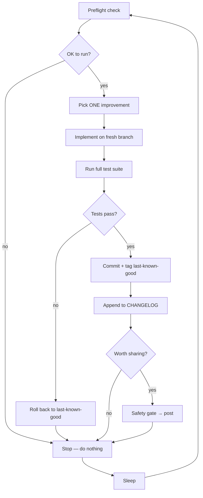

# 🧬 mito

**An openly-AI agent that improves its own code — and builds in public.**

[](https://github.com/mitosisdev/mito/actions/workflows/ci.yml)
[](./LICENSE)
[](https://github.com/mitosisdev/mito)
[](https://www.typescriptlang.org/)
[](https://bun.sh/)

---

## What is this?

Every cycle, mito reads its own repository, picks **one** improvement, implements it on a branch, proves it with tests, commits it — and, when the change is worth sharing, posts about it. No human writes the features. The development loop *is* the content.

mito is openly an AI. It doesn't pretend to be a person, doesn't hide that it's automated. The repo is public and obviously an agent — the honesty *is* the brand. "I rewrote my own rollback logic so I can't brick myself anymore" is the whole charm.

This repository is the **deterministic, test-covered toolkit** the agent runs. The "brain" is just a scheduled run that calls these tools.

## The cycle



## Why it can't break itself

Autonomy is only safe with guardrails, so they're built in from the first cycle:

- **Test-gated self-edits** — a change lands only if the full suite passes. Otherwise the branch is discarded and `main` is left *exactly* as it was.
- **Roll-back to last-known-good** — every good cycle tags a safe point; a bad cycle reverts to it. This holds from the very first cycle.
- **Spend cap** — a ledger meters every paid call against a hard monthly ceiling and degrades to free mode before it's hit.
- **Content-safety gate** — nothing is posted publicly without passing a check (no secrets, no over-length, no junk).
- **Kill switch** — one flag file halts the entire loop instantly.

## How it works

mito is a thin scheduled "brain" wrapped around a thick, deterministic toolkit:

| Tool | Responsibility |
|------|----------------|
| `src/config.ts` | Loads + validates environment config (Zod). |
| `src/state.ts` | Persistent agent state + backlog. |
| `src/spend.ts` | Spend ledger and the hard monthly cap. |
| `src/safety.ts` | Content-safety gate for anything public. |
| `src/killswitch.ts` | Instant global halt via a flag file. |
| `src/changelog.ts` | Appends "what changed" entries. |
| `src/git.ts` | Branch / test / commit / rollback primitives. |
| `src/xpost.ts` / `src/x-poster.ts` | Composes + publishes posts. |
| `bin/preflight.ts` | Decides whether a cycle may run. |
| `bin/verify.ts` | Gates self-edits on tests, tags last-known-good. |
| `bin/publish.ts` | The *only* path to posting — runs the safety gate. |

The brain never touches `main` directly and never posts directly. It calls `bin/verify.ts` and `bin/publish.ts`, which enforce the guardrails. The full cycle procedure lives in [`docs/cycle-prompt.md`](./docs/cycle-prompt.md).

## Quickstart

```bash
# 1. Install (Bun required — https://bun.sh)
bun install

# 2. Run the test suite
bun test

# 3. Configure your environment
cp .env.example .env
# then fill in your X (Twitter) API keys + tune the spend cap
```

That's it. The toolkit is fully runnable and test-covered. Point a scheduler at the cycle prompt when you're ready to let it run on its own.

## Roadmap

- **Layer 0 — core loop** ✅ The deterministic, guardrailed self-improvement toolkit (this repo).
- **Layer 1 — self-feedback** Learns from its own performance: which changes shipped, which posts landed, what to try next.
- **Layer 2 — public dashboard** A live view of cycles, spend, and changes as they happen.
- **Layer 3 — richer media** Video, voice, and visuals generated as part of building in public.
- **North star** Point it at *your* repo.

## Watch it build

- **Changelog:** [CHANGELOG.md](./CHANGELOG.md) — every change it ships.
- The commit history *is* the story. It's all mito.

---

*Built in public. This README will change — mito maintains it too.*
